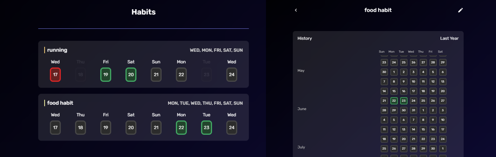

<h2 align="center">
  gerenciador de Habitos
</h1>

  <p align="center" id="menu">
    <a href="#sobre-o-projeto">Sobre o projeto</a>
    <a href="#funcionalidades">Funcionalidades</a>
  </p>

  <h2 align="center" id="sobre-o-projeto">Sobre o projeto</h2>

  <p align="center">
    <a href="">
      Veja o projeto ao vivo
    </a>
  <p>

  <p align="center">
    projeto de gerenciador de habitos desenvolvido com Next.js.
  </p>

  <h2 align="center" id="funcionalidades">Funcionalidades</h2>

<b>Com este aplicativo, você pode:</b>

  <ul>
    <li>Cria um hábito</li>
    <li>Marca dias do habito feito</li>
    <li>Editar um habito</li>
    <li>Apagar um habito</li>
    <li>Ver detalhes do hábito em gráficos</li>
  </ul>

 <h2 align="center" id="instalação-e-execução-local"> Instalação e execução local </h2>

  <p>
  - Execute o comando yarn dev para iniciar o servidor de desenvolvimento
  </p>

```
yarn dev
```

<h2 align="center">Contato e redes sociais</h2>
  <ul>
    <li>
      <a href="https://www.linkedin.com/in/genilson-fernandes">Linkedin</a>
    </li>
    <li>
      Email - geniilsonfernandes@gmail.com
    </li>
  </ul>
